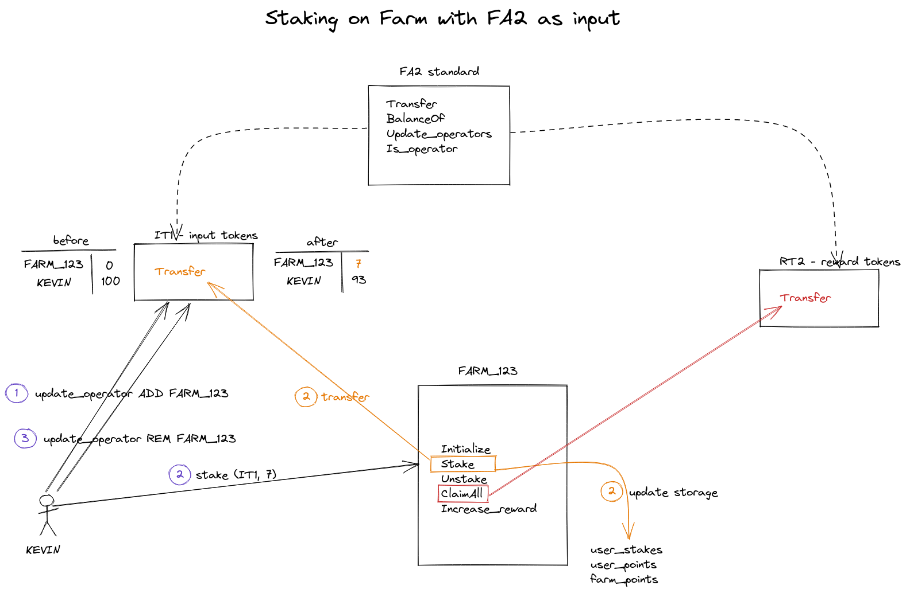

# Testing Launch pool

## Start a node

### Install Tezos node from sources
```
https://tezos.gitlab.io/introduction/howtoget.html
```

### Configure a Tezos node for hangzhounet network
```
./tezos-node config init \
  --network hangzhounet \
  --data-dir ~/.tezos-node-hangzhounet
```

### Launching a Tezos node on hangzhounet
```
./tezos-node run \
  --network hangzhounet \
  --data-dir ~/.tezos-node-hangzhounet \
  --synchronisation-threshold 1 \
  --rpc-addr localhost:8732
```

### Get Tezos faucet
- Download your faucet account from `https://teztnets.xyz/hangzhounet-faucet`
- Activate your faucet account with `tezos-client activate account faucet with /tmp/hangzhounet.json`

### Test node interaction

Once the Tezos node is running , one must wait for synchronization with the rest of the network. Running the node should automatically start the synchronization.
- Verify the Tezos node is sync with `tezos-client bootstrapped`
- List known addresses (accounts registered on the node) with `./tezos-client list known addresses` 
- List contracts that have been deployed on the node with `./tezos-client list known contracts`
- Register a contract in the "known contracts" locally with `./tezos-client remember contract reward_fa2 KT18ngw3gNSQEctEmb8Smb9XQ5SHx2imLHdz`
- Unregister a contract from the "known contracts" locally with `./tezos-client forget contract reward_fa2`

In a web browser , one can check the following URLs:
`http://127.0.0.1:8732/chains/main/blocks/head/context/constants`

## Tests

The campaign of testing must deal with 4 kind of farms:

| kind           | input | reward |
|----------------|-------|--------|
| farm_fa12_fa12 | FA1.2 | FA1.2  |
| farm_fa12_fa2  | FA1.2 | FA2    |
| farm_fa2_fa12  | FA2   | FA1.2  |
| farm_fa2_fa2   | FA2   | FA2    |

FA1.2 and FA2 contracts can be deploy using specific scripts `deploy_fa12_input.ts` and `deploy_fa2.ts`.


## Deploy contracts for testing Launchpools

The Launch pool requires:
- an input contract which specifies which kind of token are being staked (FA1.2, FA2). 
- an output contract which specifies what kind of rewards are being given to stakers (FA1.2, FA2).
- the output contract (for reward) must also specify an address holding the rewards.

So, for testing launch pools, one must:
- deploy an input contract token (FA1.2, FA2).
- mint some token to a "user" who is going to stake these tokens to the launch pool.
- deploy an output contract token (FA1.2, FA2) for rewards.
- mint some token to a `reserve` address for rewards
- Approval: the holder of the reserve of rewards must allow the newly created launch pool to be able to use the rewards
    - for FA1.2, approve (farm_id, amount_reward)
    - for FA2, Add_operator(farm_id), Remove_operator(farm_id), specify the amount ????? 
- deploy a launch pool

Now all smart contracts are deployed and setup for testing the staking/unstaking.

### deploy FA2 contract for input

- compile the deployment script `deploy_fa2_input.ts`
```
tsc deploy_fa2_input.ts --resolveJsonModule -esModuleInterop
```

- execute the deployment script `deploy_fa2_input.js`
```
node deploy_fa2_input.js
```

This script deploys a FA2 contract and mint some tokens.

### depoy FA2 contract for rewards (executed as admin)

- compile the deployment script `deploy_fa2_reward.ts`
```
tsc deploy_fa2_reward.ts --resolveJsonModule -esModuleInterop
```

- execute the deployment script `deploy_fa2_reward.js`
```
node deploy_fa2_reward.js
```
This script deploys a FA2 contract, and mint some tokens for admin and output the resulting fa2_reward contract address

### deploy the farm database contract

-  Deploy farm database contract 
```
tsc deploy_database.ts --resolveJsonModule -esModuleInterop
```
- `node deploy_database.js`
- copy the resulting address in the .env file (in field `FARMSDB_ADDRESS`)


### deploy the farm contract

- copy the fa2_reward contract address into the `deploy_farm.ts` (in field `reward_token_address`)


### authorize the farm contract to use the fa2_reward

- copy the fa2_reward contract address into the `approve_fa2_reward.ts` (in field `reward_fa2_contract`)

- compile the approval script `approve_fa2_reward.ts`
```
tsc approve_fa2_reward.ts --resolveJsonModule -esModuleInterop
```

- execute the approval script `approve_fa2_reward.js`
```
node approve_fa2_reward.js
```
This script authorize the `reward_fa2_contract` address to use the minted tokens (owned by admin)

### unauthorize the farm contract to use the fa2_reward

- copy the fa2_reward contract address into the `unapprove_fa2_reward.ts` (in field `reward_fa2_contract`)

- compile the unapproval script `unapprove_fa2_reward.ts`
```
tsc unapprove_fa2_reward.ts --resolveJsonModule -esModuleInterop
```

- execute the unapproval script `unapprove_fa2_reward.js`
```
node unapprove_fa2_reward.js
```
This script authorize the `reward_fa2_contract` address to use the minted tokens (owned by admin)


### Staking



- On FA2 (KT1DXMUuoMBMTvJ41npEwenF17hs1K7sJznc), user (tz1XyFD11RWJXwkht624fBcnXfwx3rcKccTE) authorize the farm (KT1MnDRn6L4PSA9cUVE9TLZhHW4uvgUom4ui) to take some of his token 
```
./tezos-client transfer 0 from tz1RyejUffjfnHzWoRp1vYyZwGnfPuHsD5F5 to KT1DXMUuoMBMTvJ41npEwenF17hs1K7sJznc --entrypoint "update_operators" --arg '{ Left (Pair "tz1XyFD11RWJXwkht624fBcnXfwx3rcKccTE" (Pair "KT1MnDRn6L4PSA9cUVE9TLZhHW4uvgUom4ui" 1)) }'
```

- User (tz1XyFD11RWJXwkht624fBcnXfwx3rcKccTE) triggers the stake entrypoint of the farm (KT1MnDRn6L4PSA9cUVE9TLZhHW4uvgUom4ui)
```
./tezos-client transfer 0 from tz1XyFD11RWJXwkht624fBcnXfwx3rcKccTE to KT1MnDRn6L4PSA9cUVE9TLZhHW4uvgUom4ui --entrypoint "stake" --arg "10"
```

- On FA2 (KT1DXMUuoMBMTvJ41npEwenF17hs1K7sJznc), user (tz1XyFD11RWJXwkht624fBcnXfwx3rcKccTE) stops authorizing the farm (KT1MnDRn6L4PSA9cUVE9TLZhHW4uvgUom4ui) to take some of his token 
```
./tezos-client transfer 0 from tz1RyejUffjfnHzWoRp1vYyZwGnfPuHsD5F5 to KT1DXMUuoMBMTvJ41npEwenF17hs1K7sJznc --entrypoint "update_operators" --arg '{ Right (Pair "tz1XyFD11RWJXwkht624fBcnXfwx3rcKccTE" (Pair "KT1MnDRn6L4PSA9cUVE9TLZhHW4uvgUom4ui" 1)) }'
```


# Scenario for testing FARMs

The deployment of contracts (for testing) can be done by executing one script (`deploy_full_test_env.ts`) or by executing each step with a separate script

## Setup test contract envirronment (all in one) with deploy_full_test_env.ts

The script `deploy_full_test_env.ts` deploys 4 contracts
- an input token
- a reward token
- a farm database 
- a farm

The campaign of testing must deal with 4 kind of farms:

| kind           | input | reward |
|----------------|-------|--------|
| farm_fa12_fa12 | FA1.2 | FA1.2  |
| farm_fa12_fa2  | FA1.2 | FA2    |
| farm_fa2_fa12  | FA2   | FA1.2  |
| farm_fa2_fa2   | FA2   | FA2    |


This script works with .env files. There are 4 .env files:
.env.farm_fa12_fa12 
.env.farm_fa2_fa12
.env.farm_fa12_fa2
.env.farm_fa2_fa2


One must specify in the script the correct .env file inside the script `deploy_full_test_env.ts` and recompile the script with `tsc deploy_full_test_env.ts --resolveJsonModule -esModuleInterop` before executing it with `node deploy_full_test_env.js`

## Setup test contract envirronment (step by step)

### deploy contracts (input: FA12, reward: FA2)

- deploy input fa12
```
cd SMAK-Farms/deploy
tsc deploy_fa12.ts --resolveJsonModule -esModuleInterop
node deploy_fa12.js
```
=> produces <fa12_address>

- register input fa12
```
cd tezos
./tezos-client remember contract input_fa12 <fa12_address>
```

- modify .env file
```
INPUT_CONTRACT_ADDRESS=<fa12_address>
INPUT_TOKEN_ID=
```

- deploy FA2 reward contract
``` 
cd SMAK-Farms/deploy
tsc deploy_fa2_reward.ts --resolveJsonModule -esModuleInterop
node deploy_fa2_reward.js
```
=> produces <fa2_reward_contract_address>

- register input fa2 and verify reserve quantity
```
cd tezos
./tezos-client remember contract fa2_reward <fa2_reward_contract_address>
./tezos-client get contract storage for fa2_reward
```

- modify .env file
```
REWARD_CONTRACT_ADDRESS=<fa2_reward_contract_address>
```

- deploy farm database
```
cd SMAK-Farms/deploy
tsc deploy_database.ts --resolveJsonModule -esModuleInterop
node deploy_database.js
```
=> produces <farm_database_address>

- register database contract 
```
./tezos-client remember contract farm_database <farm_database_address>
```
- modify .env file
```
FARMSDB_ADDRESS=<farm_database_address>
```

- deploy farm
```
tsc deploy_farm_reward_fa2.ts --resolveJsonModule -esModuleInterop
node deploy_farm_reward_fa2.js
```
=> produces <farm_fa12_fa2_address>

```
./tezos-client remember contract farm_fa12_fa2 <farm_fa12_fa2_address>
```
- modify .env file
```
FARM_ADDRESS=<farm_fa12_fa2_address>
```

- owner of reward reserve must approve the farm to uses reward reserve (Claim)
```
tsc approve_fa2_reward.ts --resolveJsonModule -esModuleInterop
node approve_fa2_reward.js
```

- verify that the farm is allowed to use reward reserve
```
./tezos-client get contract storage for fa2_reward
```
=> for example , we expect
```
Pair (Pair <admin>
           { Elt (Pair <owner> 1) 50000000 })
     { Pair <owner>
            <farm>
            1 }
     False
```

### test entrypoints

- mint some token on fa12 for our user
- approve on fa12 the farm as operator for token owned by our user
- stake some token on the farm
- wait a bit
- claim your reward


## deploy contracts (input: FA12, reward: FA12)

- deploy input fa12
```
cd SMAK-Farms/deploy
tsc deploy_fa12.ts --resolveJsonModule -esModuleInterop
node deploy_fa12.js
```
=> produces <fa12_address>

- register input fa12
```
cd tezos
./tezos-client remember contract input_fa12 <fa12_address>
```

- modify .env file
```
INPUT_CONTRACT_ADDRESS=<fa12_address>
INPUT_TOKEN_ID=
```

- deploy FA12 reward contract
``` 
cd SMAK-Farms/deploy
tsc deploy_fa12_reward.ts --resolveJsonModule -esModuleInterop
node deploy_fa12_reward.js
```
=> produces <fa12_reward_contract_address>

- register reward fa12 and verify reserve quantity
```
cd tezos
./tezos-client remember contract fa12_reward <fa12_reward_contract_address>
./tezos-client get contract storage for fa12_reward
```

- modify .env file
```
REWARD_CONTRACT_ADDRESS=<fa12_reward_contract_address>
REWARD_TOKEN_ID=
```

- deploy farm database (if not yet deployed)
```
cd SMAK-Farms/deploy
tsc deploy_database.ts --resolveJsonModule -esModuleInterop
node deploy_database.js
```
=> produces <farm_database_address>

- register database contract 
```
./tezos-client remember contract farm_database <farm_database_address>
```
- modify .env file
```
FARMSDB_ADDRESS=<farm_database_address>
```

- deploy farm
```
tsc deploy_farm_reward_fa12.ts --resolveJsonModule -esModuleInterop
node deploy_farm_reward_fa12.js
```
=> produces <farm_fa12_fa12_address>

```
./tezos-client remember contract farm_fa12_fa2 <farm_fa12_fa12_address>
```
- modify .env file
```
FARM_ADDRESS=<farm_fa12_fa12_address>
```

- owner of reward reserve must approve the farm to uses reward reserve (Claim)
```
tsc approve_fa12_reward.ts --resolveJsonModule -esModuleInterop
node approve_fa12_reward.js
```

- verify that the farm is allowed to use reward reserve
```
./tezos-client get contract storage for fa12_reward
```
=> for example , we expect
```
Pair (Pair <admin>
           { Elt (Pair <owner> 1) 50000000 })
     { Pair <owner>
            <farm>
            1 }
     False
```

